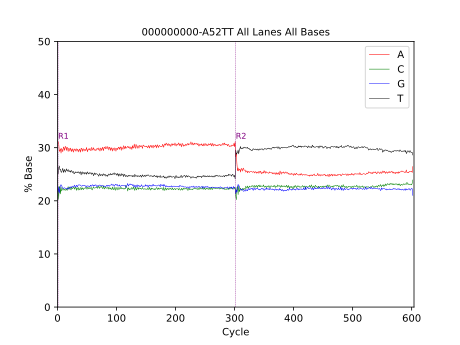
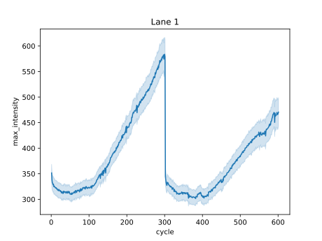

# Sample workflow output

## Run Summary

The `run_summary.py` script outputs a run metrics json and html file. This is similar to what you would get in the Run Summary tab in the SAV Viewer software.

[run_metrics.html](run_metrics.html)

[run_metrics.json](run_metrics.json)

## % Base

This plots the base % across each cycle. Each line represents a different base.
Reference lines are added for each read.

File: `percent_base.svg`

## Tile intensity

This plots the combined tile intensity for each lane.

File: `max_intensity_1.svg`

## % Occupancy (NovaSeq only)

The % Occupied and % Pass Filter metrics are plotted to determine if a run was underloaded, optimally loaded, or overloaded.

More information found [here](https://support.illumina.com/bulletins/2020/03/plotting---occupied-by---pass-filter-to-optimize-loading-concent.html).

## Demo dataset

Download the MiSeqDemo.zip dataset [here](https://github.com/Illumina/interop/releases/download/v1.0.6/MiSeqDemo.zip).
